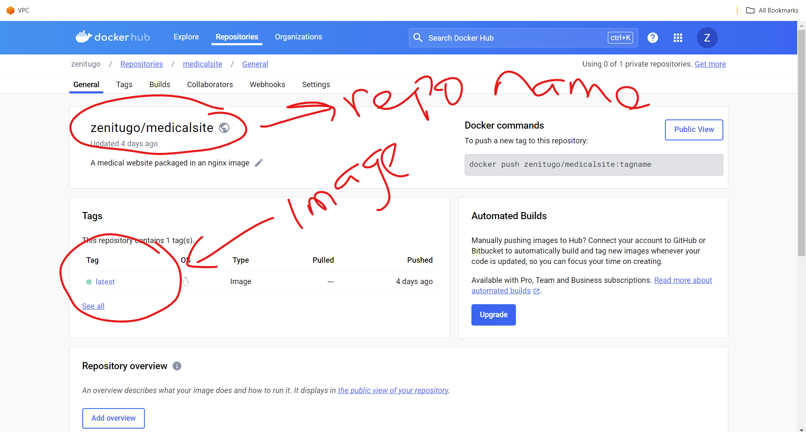

# PRE-REQUISITES
  - Install Docker.
  - Install Kubernetes.
  - Install Minikube and connect Docker driver to minikube.
  - Install Kubectl.
  

## How to Install Kubectl

```
curl -LO "https://dl.k8s.io/release/$(curl -L -s https://dl.k8s.io/release/stable.txt)/bin/linux/amd64/kubectl"
sudo install -o root -g root -m 0755 kubectl /usr/local/bin/kubectl

```


## How to Install Minikube on Linux

```
curl -LO https://storage.googleapis.com/minikube/releases/latest/minikube-linux-amd64
sudo install minikube-linux-amd64 /usr/local/bin/minikube
minikube start --driver=docker

```


# DOCKER
Instead of creating a web page I decided to deploy a web page I got from (https://www.free-css.com/).

A *docker file* was used to write sets of commands that would package the application into a *docker image*. I used nginx as the base image, installed wget so that I would be able to download the application files and I used unzip to unzip the folder and copy it to the `/usr/share/nginx/html directory.

The docker image with the command `docker build -t zenitugo/medicalsite .` and pushed to docker hub with the command `docker login` to login into docker hub and `docker push zenitugo/medicalsite` to push to docker hub.

*Note:* YOU HAVE TO CREATE A REPO WITH THE SAME NAME ON DOCKERHUB BEFORE PUSHING TO DOCKER HUB

##  Proof to show image was pushed to docker hub



# Kubernetes Cluster using minikube
I created the kubernetes deployment and service using yaml files

`kubectl apply -f <filename>` was the command used to create the cluster
`kubectl get pods` was used to see the two pods created.
`kubectl get svc` was used to see the service created

Since I am using minikube, I decided to use a NodePort to enable me view my application on he browser.
` minikube service mediapp-external-service` was used to display the url I would use to view my application on the browser.

## Proof of Deployment 
*Image of the pods on my linux terminal*


*Video of the application deployed with minikube*
[video](./video/20240224191515.mp4)


